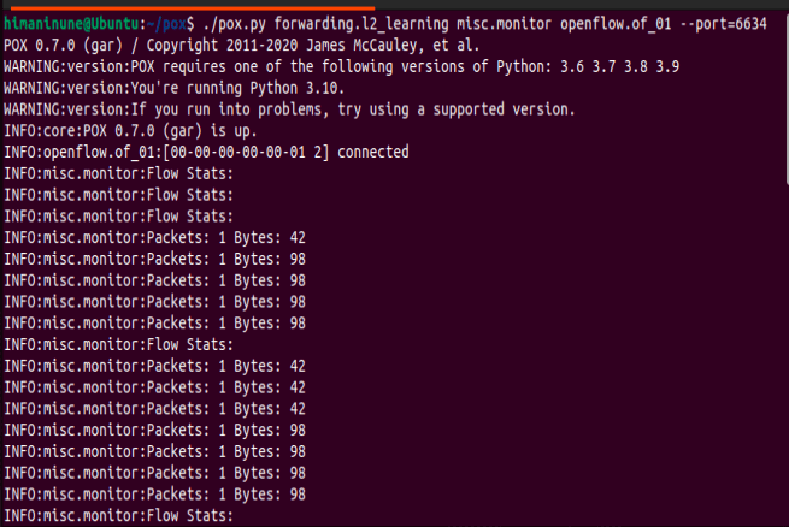
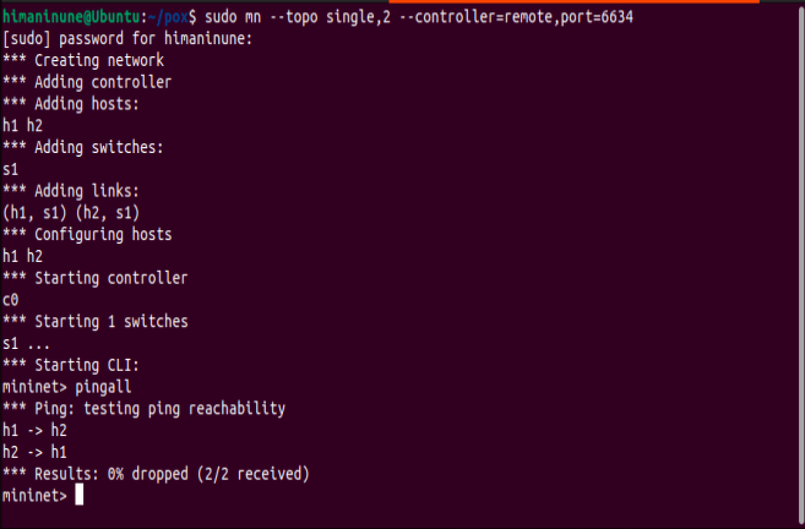
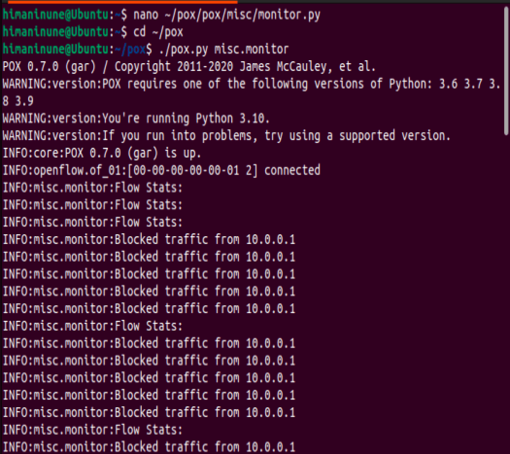
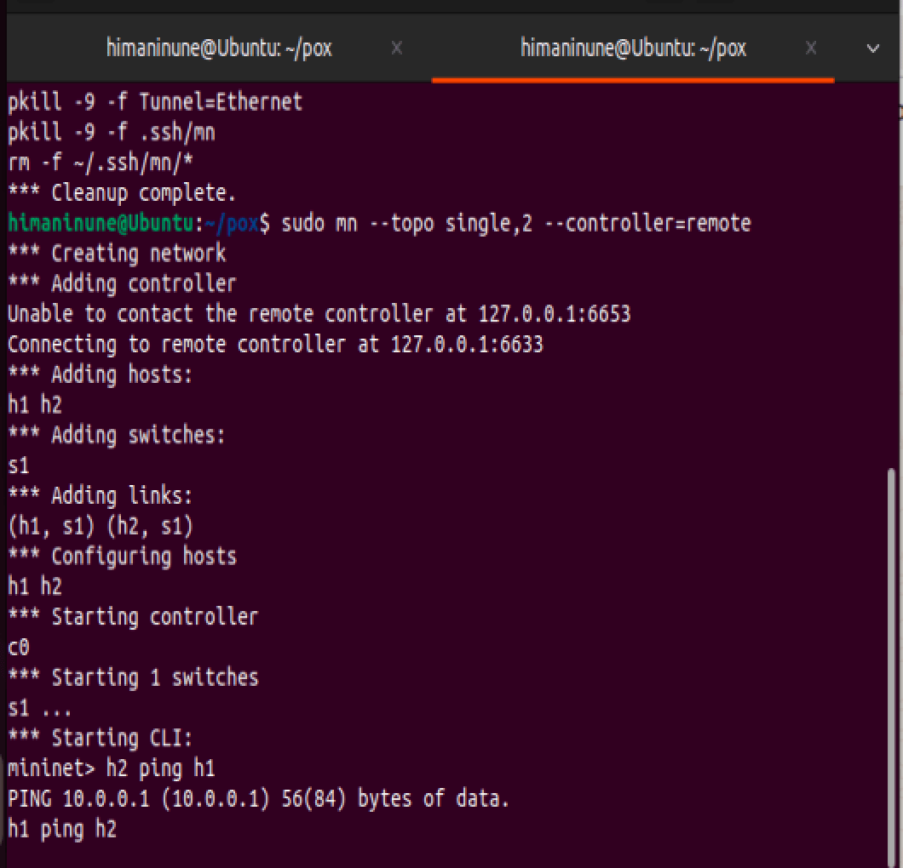
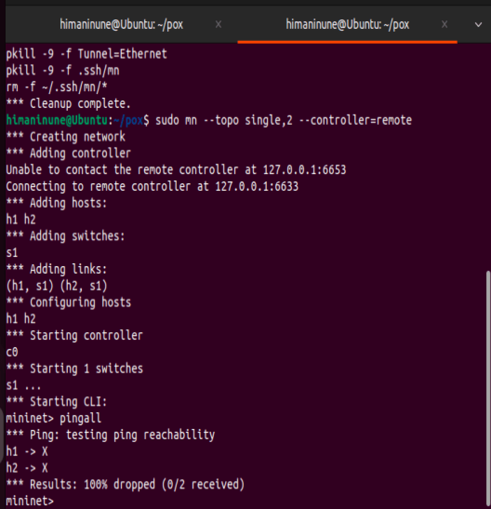
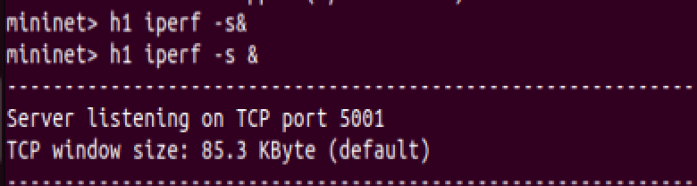
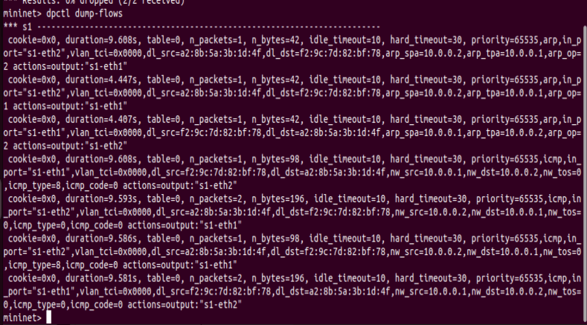
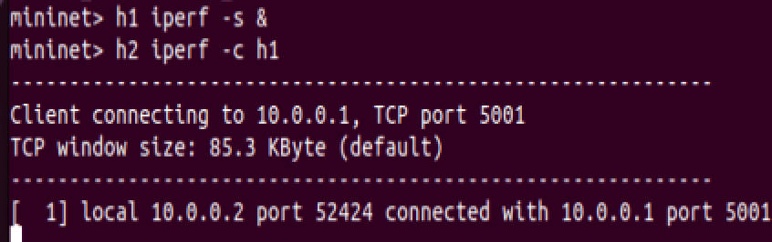
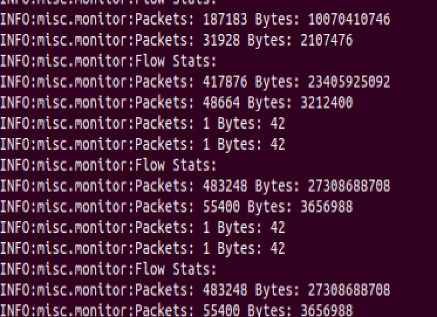

# SDN Traffic Monitoring using POX Controller

## Problem Statement

The goal of this project is to monitor and control network traffic in a Software Defined Network (SDN) using the POX controller.

We implemented a system where:

* Network traffic is monitored in real time
* Flow statistics (packets and bytes) are collected
* Specific traffic (from a host) can be detected and blocked

---

##  Setup and Execution Steps

### 1. Start POX Controller

```bash
./pox.py forwarding.l2_learning misc.monitor openflow.of_01 --port=6634
```

---

### 2. Start Mininet Topology

```bash
sudo mn --topo single,2 --controller=remote,port=6634
```

---

### 3. Test Connectivity

```bash
pingall
```

---

### 4. Generate Traffic (iperf)

Start server:

```bash
h1 iperf -s &
```

Start client:

```bash
h2 iperf -c h1
```

---

### 5. View Flow Table

```bash
dpctl dump-flows
```

---

##  Expected Output

* Flow statistics should be printed in POX terminal:

  ```
  Flow Stats:
  Packets: X Bytes: Y
  ```

* Ping should initially succeed:

  ```
  Results: 0% dropped
  ```

* After applying blocking logic:

  ```
  Results: 100% dropped
  ```

* Flow table entries should appear when traffic flows

---

##  Proof of Execution

###  Flow Statistics



---

###  Successful Ping



---

###  Blocked Traffic Detection



---

###  Ping Failure After Blocking



---

###  Manual Ping Test



---

###  Iperf Server



---

###  Iperf Client



---

###  Flow Table Dump



---

###  Final Flow Statistics



---


##  Notes

* The warning about Python version (3.10) can be ignored since POX still runs correctly
* Flow statistics confirm that traffic is being monitored properly
* Blocking logic works as expected by dropping packets

---

##  Conclusion

This project demonstrates how SDN can be used to monitor and control network traffic dynamically. Using POX and Mininet, we were able to observe real-time traffic, analyze flows, and enforce simple security policies like blocking a host.

---
